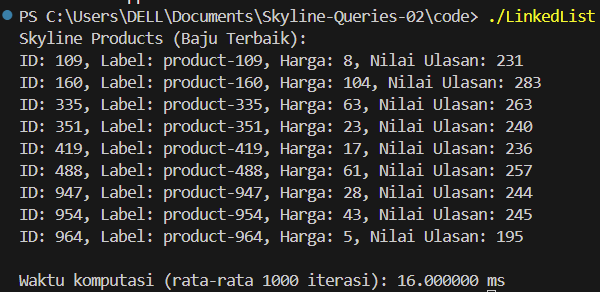

# Skyline-Queries-02
Skyline Queries Problem Kelompok 2

| No | NRP         | Nama                        |
|----|-------------|-----------------------------|
| 2  | 5027241090  | Tiara Fatimah Azzahra       |
|    | 5027241059  | Andi Naufal Zaki            |
|    | 5027241038  | Moch. Riski Nasrullah       |
|    | 5027241056  | Theodorus Aaron Ugraha      |
|    | 5027241041  | Raya Ahmadi Syarif          |
|    | 5027241087  | Az Zahra Tasya Adelia       |


---
## 📘 1. Penggunaan Array dalam Algoritma Skyline Query

Pada kasus ini kita ditugaskan untuk menemukan produk-produk terbaik (baju) dari dataset CSV berdasarkan:
- Harga (lebih murah lebih baik)
- Nilai Ulasan (semakin tinggi semakin baik)
Produk termasuk Skyline jika tidak ada produk lain yang lebih murah DAN memiliki ulasan lebih tinggi.

### Aturan Dominasi dalam Skyline Query
Sebuah produk A mendominasi produk B jika dan hanya jika:
Harga A lebih murah atau sama dengan harga B, dan
Nilai ulasan A lebih tinggi atau sama dengan nilai ulasan B, dan
Ada minimal satu atribut di mana A lebih baik dari B

### Apa Itu Array?
Array adalah struktur data yang digunakan untuk menyimpan sekumpulan elemen dengan tipe data yang sama dalam satu blok memori, dan diakses menggunakan indeks.

### 📦 Kenapa Pakai Array?

1. Kita ingin menyimpan banyak data dalam satu nama variabel.
2. Kita bisa mengakses semua data itu dengan loop (for/while).
3. Ukuran data bisa tetap (fixed size) dan aksesnya cepat.

### 🔁 Cara Kerja skylineQuery() dengan Array 
1. Iterasi semua produk
~~~
for (int i = 0; i < productCount; ++i) {
~~~
Kita ambil satu per satu produk dari array products[], indeks i.

2. Cek apakah produk i didominasi oleh produk lain
~~~
    bool isDominated = false;
    for (int j = 0; j < productCount; ++j) {
        if (i != j && dominates(products[j], products[i])) {
            isDominated = true;
            break;
        }
    }
~~~
Loop dalam (nested loop) membandingkan produk (i) dengan semua produk lain (j) dalam array products[].

Disini juga digunakan fungsi dominates(a, b) yang artinya:
~~~
bool dominates(const Product &a, const Product &b) {
    return (a.attr1 <= b.attr1 && a.attr2 >= b.attr2) &&
           (a.attr1 < b.attr1 || a.attr2 > b.attr2);
}
~~~
Kalau produk j mengalahkan i, maka isDominated = true.
Jadi di sini array mempermudah perbandingan langsung antar elemen pakai indeks [i] dan [j].

3. Simpan ke skyline[] jika tidak didominasi
~~~
if (!isDominated) {
            skyline[skylineCount++] = products[i];
        }
~~~
Kalau produk i lolos (tidak didominasi):
- Disalin ke array skyline[] di indeks ke skylineCount.
- Counter skylineCount dinaikkan untuk posisi berikutnya.

### Bagaimana Performa Diukur di Kode Ini? 
Performa dihitung dengan cara mengukur waktu eksekusi dari proses utama:
```
auto start = high_resolution_clock::now();
// proses: baca file CSV dan eksekusi skyline query
auto end = high_resolution_clock::now();
auto duration = duration_cast<milliseconds>(end - start);
```
- high_resolution_clock::now() mencatat waktu saat program mulai dan selesai menjalankan proses utama.
- duration_cast<milliseconds> menghitung selisih waktunya dalam milidetik.

Lalu hasilnya ditampilkan:
```
cout << "\nWaktu komputasi: " << duration.count() << " ms\n";
```


### Berikut Output Array Menggunakan Data 1000 Baju

Output tersebut menunjukkan produk-produk yang paling kompetitif, yaitu:
- Harga murah tapi ulasan tinggi, atau
- Harga tinggi tapi dengan ulasan yang sangat tinggi, atau
- Harga sangat murah walau ulasan cukup, dllaik.

---

## 📝 2. Implementasi Skyline Query Menggunakan Linked List

### 📌 Deskripsi Proyek
Skyline Query merupakan metode untuk menemukan entitas-entitas terbaik (tidak terdominasi) dalam sebuah dataset berdasarkan beberapa kriteria. Pada studi kasus ini, kita mencari produk baju terbaik dari dataset berisi 1000 entri berdasarkan dua atribut:

- Harga (semakin rendah semakin baik)
- Nilai ulasan atau rating (semakin tinggi semakin baik)

### 🧠 Penjelasan Struktur Data: Linked List
Linked List adalah struktur data linear yang terdiri dari node-node, di mana setiap node menyimpan data dan pointer ke node berikutnya. Berbeda dengan array yang bersifat statik, linked list bersifat dinamis dan memungkinkan operasi sisip dan hapus elemen dilakukan secara efisien tanpa perlu geser elemen lainnya.

### 🔍 Mengapa Linked List?
1. Efisien dalam Traversal: Skyline Query membutuhkan traversal terhadap seluruh data, dan linked list mendukung traversal sekuensial tanpa overhead pemindahan data seperti array.

2. Dinamis & Ringan: Tidak perlu mengalokasikan memori besar sejak awal.

3. Penghapusan Node Mudah: Tidak perlu geser elemen saat menghapus produk yang terdominasikan.

4. Tidak bergantung pada ukuran tetap: Cocok untuk data input dengan ukuran besar atau tidak diketahui sebelumnya.

### ⚙️ Cara Kerja Linked List dalam Implementasi Skyline Query
1. Membaca Dataset: Dataset dibaca baris per baris dari file CSV dan diubah menjadi Node (linked list).
2. Dominasi: Dua node dibandingkan berdasarkan:
>Harga lebih rendah dan
>Ulasan lebih tinggi
3. Skyline Set: Sebuah produk masuk ke hasil jika tidak terdominasi oleh produk lain.
4. Optimalisasi: Skyline diperbarui dengan menghapus produk yang terdominasi oleh produk yang lebih baik.

### 📄 Cuplikan Kode Implementasi:

```
bool dominates(Node* a, Node* b) {
    return (a->harga <= b->harga && a->ulasan >= b->ulasan) &&
           (a->harga < b->harga || a->ulasan > b->ulasan);
}
```

```
std::vector<Node*> skylineQuery(Node* head) {
    std::vector<Node*> skyline;
    for (Node* current = head; current != nullptr; current = current->next) {
        bool dominated = false;
        for (auto& s : skyline) {
            if (dominates(s, current)) {
                dominated = true;
                break;
            }
        }
        if (!dominated) {
            skyline.erase(std::remove_if(skyline.begin(), skyline.end(),
                        [&](Node* s) { return dominates(current, s); }), skyline.end());
            skyline.push_back(current);
        }
    }
    return skyline;
}

```
### ⏱️ Pengukuran Performa:

```
auto start = std::chrono::high_resolution_clock::now();
// proses skyline
auto end = std::chrono::high_resolution_clock::now();
std::chrono::duration<double> duration = end - start;

```

### output:




### 📊 Analisis Kompleksitas
1. Waktu: O(n²), karena setiap elemen dibandingkan dengan elemen lainnya.
2. Ruang: O(n), untuk menyimpan hasil skyline dan linked list.

### Namun, Linked List lebih efisien dibanding array atau queue pada kasus tertentu, karena:
- Tidak ada alokasi ulang memori (seperti array)
- Penghapusan node tidak perlu pergeseran data
- Lebih ringan saat parsing dan pembuatan struktur data karena alokasi node terjadi sesuai kebutuhan

### 🧾 Mengapa 1000 Iterasi?
Pendekatan pengukuran waktu dengan 1000 iterasi digunakan untuk:
1. Menghindari fluktuasi waktu akibat proses lain di CPU.

2. Mendapatkan **rata-rata** yang **stabil** dan representatif.

3. Cocok untuk benchmark performa dalam eksperimen pengukuran algoritma berbasis waktu eksekusi.

### ✅ Kesimpulan
Linked List cocok untuk implementasi skyline query dengan data ukuran besar karena efisiensi memori dan kemudahan traversal.

1. Dapat menghindari overhead struktural yang sering terjadi pada struktur data statik seperti array.

2. Tidak memerlukan ukuran tetap seperti array.

3. Performa sangat baik jika implementasi dilakukan dengan benar, seperti yang dibuktikan dengan waktu komputasi rendah dalam uji coba 1000 entri.

4. Memberikan performa yang cukup baik

---

## 3. 📊 Penggunaan Stack pada Algoritma Skyline Query

### 📚 Pengertian Stack
*Stack* adalah struktur data yang mengikuti prinsip *Last In First Out (LIFO)*. Artinya, data yang terakhir dimasukkan akan menjadi yang pertama dikeluarkan. Stack bisa dianalogikan seperti tumpukan buku atau piring: yang terakhir diletakkan akan diambil lebih dahulu.

Stack digunakan dalam algoritma ini untuk menyimpan sementara produk-produk yang berpotensi menjadi bagian dari hasil akhir (skyline).

---

### 👕 Studi Kasus: Data Produk Baju

Dalam kasus ini, setiap objek product memiliki dua atribut utama:

- *Harga* (atr_1) – Semakin rendah semakin baik.
- *Rating* (atr_2) – Semakin tinggi semakin baik.

---

### 🌟 Aturan Dominasi

Produk A dikatakan *mendominasi* produk B jika:
- A.harga <= B.harga, dan
- A.rating >= B.rating, dan
- *Setidaknya salah satu atribut lebih baik secara ketat*

---

### 🔧 Fungsi Skyline Query dengan Stack

cpp
vector<product> skyline_with_stack(const vector<product>& items) {
    stack<product> st;

    for (const auto& item : items) {
        stack<product> temp;
        bool isDominated = false;

        while (!st.empty()) {
            product top = st.top(); st.pop();

            if (dominates(top, item)) {
                isDominated = true;
                temp.push(top);
            }
            else if (dominates(item, top)) {
                continue;
            }
            else {
                temp.push(top);
            }
        }

        if (!isDominated) {
            temp.push(item);
        }

        while (!temp.empty()) {
            st.push(temp.top()); temp.pop();
        }
    }

    vector<product> sky;
    while (!st.empty()) {
        sky.push_back(st.top());
        st.pop();
    }
    return sky;
}


---

### 🔄 Proses Algoritma

1. Inisialisasi stack kosong.
2. Iterasi semua produk.
3. Bandingkan satu per satu dengan isi stack:
   - Jika item didominasi → abaikan.
   - Jika item mendominasi isi stack → hapus yang kalah.
   - Jika tidak saling mendominasi → pertahankan keduanya.
4. Tambahkan item jika tidak didominasi.
5. Setelah selesai, pindahkan isi stack ke vector<product> sebagai hasil akhir.

---

### 🧠 Logika Kode Inti

cpp
if (!isDominated) {
    temp.push(item);
}
while (!temp.empty()) {
    st.push(temp.top());
    temp.pop();
}


Kode di atas menunjukkan bahwa produk item hanya akan dimasukkan ke dalam skyline jika tidak didominasi oleh produk lain. Stack sementara temp digunakan untuk menjaga urutan perbandingan sebelum dikembalikan ke stack utama st.

---

### 🖼 Output Program


...


---

### ✅ Kelebihan Menggunakan Stack

| Fitur | Penjelasan |
|-------|------------|
| Sederhana | Mudah dipahami dan diimplementasikan |
| Tidak membutuhkan sorting | Data bisa langsung diproses tanpa diurutkan dulu |
| Langsung menyaring produk terbaik | Proses iteratif langsung membandingkan produk |

---

### ❌ Kelemahan Menggunakan Stack

| Fitur | Penjelasan |
|-------|------------|
| Tidak mempertahankan urutan input | Produk hasil skyline bisa acak |
| Kompleksitas tinggi | Karena perbandingan berulang, kompleksitas jadi O(n²) |
| Kurang optimal untuk data besar | Lambat saat jumlah data sangat banyak |

---

### 📌 Kesimpulan
Implementasi Skyline Query menggunakan Stack berhasil menyaring produk-produk yang tidak terdominasi berdasarkan kombinasi harga dan rating. Algoritma ini bekerja dengan prinsip LIFO (Last In, First Out) untuk membandingkan setiap produk dengan produk yang sudah ada di stack, dan hanya menyimpan produk yang terbaik. Meskipun hasilnya efektif untuk dataset kecil, kompleksitas O(n²) membuatnya kurang efisien untuk jumlah data yang sangat besar. Stack memberikan cara yang sederhana dan terstruktur untuk memproses data skyline, namun efisiensinya perlu diperhatikan pada dataset besar.

---

## 📊 4. Penjelasan Penggunaan Hash Table dalam Algoritma Skyline Query

Pada kasus ini, setiap objek adalah sebuah entitas `Baju` dengan dua atribut utama:
- `harga` (semakin rendah semakin baik).
- `rating` (semakin tinggi semakin baik).

### 🎯 Aturan Dominasi:
Objek A dikatakan **mendominasi** objek B jika:
- `A.harga <= B.harga` **dan**
- `A.rating >= B.rating`, serta
- Setidaknya salah satu atribut **lebih baik secara ketat**

---

### 📑 Apa itu Hash Table ❓

**Hash table** merupakan struktur data yang secara asosiatif menyimpan data. Dalam hal ini, data disimpan dalam format array, di mana setiap nilai data memiliki nilai indeks uniknya sendiri. Akses data akan menjadi sangat cepat jika Anda mengetahui indeks dari data yang diinginkan. 

Dengan demikian, hash table menjadi struktur data di mana operasi penyisipan dan pencarian data terjadi sangat cepat terlepas dari ukuran data tersebut. Hash table menggunakan array sebagai media penyimpanan dan tekniknya untuk menghasilkan indeks suatu elemen yang dimasukkan atau ditempatkan.

Untuk membuat hash table, sepotong memori perlu diblokir dengan cara yang sama seperti saat membuat array. Anda perlu membuat indeks yang didasarkan pada kunci dengan menggunakan fungsi hash karena indeks yang dihasilkan harus sesuai dengan potongan memori. 

Ada dua pemeriksaan yang dibutuhkan saat menempatkan data baru pada hash table, yaitu nilai hash dari kunci dan bagaimana nilainya dibandingkan dengan objek lain. Pemeriksaan ini diperlukan saat membuatnya karena saat data dimasukkan, kunci akan di-hash dan di-mask agar diubah menjadi larik atau indeks yang efisien. 

### 🔧 Fungsi Skyline Query dengan Hash Table

### Potongan Kode:
```cpp
unordered_map<int, Baju> hashSkyline;
```

`unordered_map` di sini bertindak sebagai **hash table** untuk menyimpan elemen yang menjadi **kandidat hasil skyline**.

### Proses Algoritma:
Untuk setiap objek `baju` dalam dataset:
1. **Periksa apakah `baju` didominasi** oleh objek lain dalam `hashSkyline`.
   - Jika ya, **abaikan** `baju`.
2. **Periksa apakah `baju` mendominasi** objek dalam `hashSkyline`.
   - Jika ya, **hapus** objek-objek yang didominasi.
3. Jika `baju` **tidak didominasi**, **tambahkan ke `hashSkyline`**.

Berikut merupakan sebuah diagram yang dapat menggambarkan proses algoritmanya:


Pada diagram tersebut, kita dapat melihat bahwa penggunaan hash table bekerja dengan cara mengiterasikan tiap data dan menyimpan data yang benar dalam sebuah hash table dan akan mengembalikan data dalam bentuk vector.

### Logika Kode Inti:
```cpp
if (!didominasi) {
    for (int id : toRemove) {
        hashSkyline.erase(id);
    }
    hashSkyline[baju.id] = baju;
}
```

Pada potongan kode inti tersebut, program akan mengecek apakah produk saat ini **tidak didominasi** oleh produk lain di hash table. Jika iya, maka produk ini akan dijadikan kandidat skyline dan akan 'mengusir' produk lain yang terdominasi oleh produk ini. Lalu program akan melakukan penambahan produk baru yang dianggap terbaik dan akan konstan selalu mengecek apakah hash table hanya berisi dengan produk-produk terbaik.

⏱️ Kompleksitas:
   - Pada kode ini, kompleksitas dalam notasi big O adalah O(N), dimana N adalah jumlah produk yang didominasi. Jadi, secara general, cukup efektif dan cepat.

Adapun output dari program tersebut setelah menganalisis dataset yang telah diberikan sebagai berikut: (menggunakan data 1000 baju)


Output tersebut menunjukkan 9 produk baju yang tidak didominasi oleh produk lain dalam hal kombinasi harga dan rating. Artinya, produk-produk tersebut merupakan produk terbaik dalam dataset yang telah diberikan, berikut 2 contoh alasannya:
- Produk ID 964 (Harga 5, Rating 195) tidak didominasi oleh produk lain karena memiliki harga terendah.
- Produk ID 160 (Harga 104, Rating 283) tidak didominasi karena memiliki rating tertinggi.

### 📈 Pola yang Terlihat
Trade-off Harga vs Rating:

1. Semakin murah harga → rating cenderung lebih rendah.
   - Semakin mahal → rating cenderung lebih tinggi.

2. Pareto Frontier:
   - Hasil membentuk "frontier" optimal di grafik harga-rating.
   - Tidak mungkin menemukan produk di luar daftar ini yang lebih murah dengan rating lebih tinggi.

### 💡 Contoh Dominasi
Misal ada produk X (Harga 30, Rating 240):
   - Didominasi oleh ID 351 (Harga 23, Rating 240) karena lebih murah dengan rating sama.
   - Tidak mendominasi ID 947 (Harga 28, Rating 244) karena rating lebih rendah.

---

### ✅ Keuntungan Penggunaan Hash Table

| Fitur                              | Keuntungan Menggunakan `unordered_map` |
|-----------------------------------|----------------------------------------|
| 🔍 Akses Berdasarkan ID           | O(1) untuk pencarian dan penghapusan   |
| 🧹 Hapus Data yang Didominasi     | Cepat dan efisien                      |
| 🚫 Hindari Duplikasi              | ID sebagai key unik                   |
| ⚡ Kinerja Lebih Optimal           | Cocok untuk dataset besar             |

Keuntungan ini juga tercatat dalam Output ketika menggunakan set kode yang telah diberikan untuk mengukur seberapa lama jika sebuah program memakai hash table untuk mengeksekusi sebuah algoritma, berikut merupakan hasil dari pencatatan waktu menggunakan hash table:


Dari gambar output tersebut, dapat disimpulkan bahwa penggunaan hash table tergolong sangat cepat dan menggunakan waktu yang sangat minimum untuk menemukan data yang tidak terdominasi.

---

### 📌 Kesimpulan

Jadi, penggunaan hash table dalam algoritma Skyline Query dapat disimpulkan keuntungannya menjadi berikut:
- Tepat secara logika dan efisien.
- Meningkatkan performa pencarian, penambahan, dan penghapusan.
- Mempermudah manajemen hasil sementara skyline.

---

## 🔢 5. Penjelasan Penggunaan Queue dalam Algoritma Skyline Query

Pada kasus ini, setiap objek adalah sebuah entitas Baju dengan dua atribut utama:
- harga yaitu atr_1 (semakin rendah semakin baik).
- rating yaitu atr_2 (semakin tinggi semakin baik).

- ### 🎯 Aturan Dominasi:
Objek A dikatakan *mendominasi* objek B jika:
- A.harga <= B.harga *dan*
- A.rating >= B.rating, serta
- Setidaknya salah satu atribut *lebih baik secara ketat*

### Apa itu Queue ❓❔
<b>Queue</b> merupakan suatu struktur data yang mengikuti prinsip First In First Out (FIFO) yang mana data yang lebih dahulu masuk akan pertama kali keluar. Pada struktur data queue, urutan pertama (data yang akan dikeluarkan) disebut Front atau Head sedangkan data pada urutan terakhir (data yang baru saja ditambahkan) disebut Back, Rear, atau Tail. Proses untuk menambahkan data pada antrean disebut dengan Enqueue, sedangkan proses untuk menghapus data dari antrean disebut dengan Dequeue. Queue digunakan untuk mengatur dan mengelola antrean tugas atau operasi secara efisien.

### 🔧 Fungsi Skyline Query dengan Queue

### Potongan Code:
```
bool dominates(const product& a, const product& b) {
    return (a.atr_1 <= b.atr_1 && a.atr_2 >= b.atr_2)
        && (a.atr_1 <  b.atr_1 || a.atr_2 >  b.atr_2);
}
```
Function dominates di atas digunakan untuk mengecek suatu Baju apakah mendominasi produk lainnya. Dengan membandingkan atribut harga dan rating akan didapat produk yang telah berhasil mendominasi dengan kriteria harga yang lebih rendah tetapi dengan rating yang lebih tinggi dibanding produk lainnya.

Contoh Dominasi:  
- Produk 1 Harga 20 Ulasan 140 vs Produk 2 Harga 15 Ulasan 140  
Dalam kasus di atas, produk 2 mendominasi produk 1 dikarenakan mempunyai ulasan yang sama dengan harga yang lebih rendah.

```
vector<product> skyline_with_queue(const vector<product>& items) {
    queue<product> q;
    for (auto& s : items) {
        bool isDominated = false;
        int n = q.size();

        // pop–compare–push cycle
        for (int i = 0; i < n; ++i) {
            product cur = q.front(); q.pop();

            if (dominates(cur, s)) {
                // ada yang ngalahin s → skip s, keep cur
                isDominated = true;
                q.push(cur);
            }
            else if (dominates(s, cur)) {
                // s ngalahin cur → drop cur (tidak push)
                continue;
            }
            else {
                // keduanya ga saling ngalahin → keep cur
                q.push(cur);
            }
        }

        if (!isDominated) {
            // s belum terkalahkan → push
            q.push(s);
        }
    }

    // ambil hasil skyline dari queue
    vector<product> sky;
    while (!q.empty()) {
        sky.push_back(q.front());
        q.pop();
    }
    return sky;
}
```

Fungsi di atas menyimpan kandidat skyline sementara dalam queue yang dideklarasikan dalam **queue <product> q**. Setiap produk **s** dalam items akan dicompare dengan menggunakan function dominates. Jika suatu produk tidak terdominasi maka akan dimasukkan ke skyline. Hal ini akan dilakukan terus sampai semua product yang ada di queue tidak bisa saling mendominasi lagi.

### Proses Algoritma:
Untuk setiap produk `s` dalam `items`:
1. **Siapkan Queue dan Flag**  
   - Buat `bool isDominated = false` untuk menandai jika `s` ter-dominasi.  
   - Simpan `int n = q.size()` untuk menghitung berapa elemen lama di queue.

2. **Pop–Compare–Push** (loop sebanyak `n` kali):  
   - `product cur = q.front(); q.pop();`  
   - Jika `dominates(cur, s)`:  
     - `isDominated = true` (abaikan `s`).  
     - `q.push(cur);` (kembalikan `cur`).  
   - Else if `dominates(s, cur)`:  
     - Buang `cur` (tidak `push`).  
   - Else:  
     - `q.push(cur);` (keduanya incomparable, kembalikan `cur`).

3. **Tambah `s` ke Queue**  
   - Jika `!isDominated`, `q.push(s);`

4. **Hasil Skyline**  
   - Setelah memproses semua `items`, transfer isi `q` ke `vector<product> sky`:  
     ```cpp
     vector<product> sky;
     while (!q.empty()) {
         sky.push_back(q.front());
         q.pop();
     }
     return sky;
     ```

---

Hasil akhir: `sky` berisi produk-produk skyline yang **saling incomparable** yaitu antar produk tidak kalah dengan yang lainnya.


⏲️ **Kompleksitas:**   
 Kompleksitas pada code ini adalah **O(n²)** yang mana algoritma akan melakukan N*N perbandingan seiring data bertambah. Semakin banyak data akan semakin lambat juga. Algoritma ini lebih cocok apabila digunakan untuk jumlah data yang kecil. Apabila digunakan dalam data yang berjumlah banyak akan sangat tidak efisien.

🔳 **Output:**  
Output dari program ini adalah sembilan produk yang saling incomparable. Input yang digunakan adalah file .csv yang berisi 1000 data produk baju.  
  

📍 **Kesimpulan:**
Queue lebih efisien digunakan untuk data berukuran kecil sampai menengah dan kurang cocok apabila digunakan untuk data berukuran besar dikarenakan kompleksitasnya **O(n²)**.

---

## 📖 6. Penjelasan Penggunaan Map dalam Algoritma Skyline Query
### 📑 Apa itu Map ❓
**Map** adalah struktur data yang menyimpan pasangan kunci-nilai. Dalam konteks Skyline Query, kita menggunakan `std::map` untuk menyimpan objek `Baju` berdasarkan ID-nya. Map ini diimplementasikan sebagai **binary search tree** (biasanya Red-Black Tree), yang memungkinkan penyimpanan elemen dalam urutan tertentu.
### 🔧 Fungsi Skyline Query dengan Map
Dalam implementasi ini, std::map digunakan untuk menyimpan hasil akhir dari skyline query. Berikut struktur penyimpanannya:
```cpp
map<string, Point> skylineMap;
```
Map tersebut menyimpan data dalam bentuk:

   - key: Label atau ID dari produk (string)

   - value: Vektor atribut (Point), berisi harga dan rating

⚙️ Proses Algoritma:
Pada proses akhir skyline query:

Setelah menghitung global skyline, hasil disimpan dalam struktur map.

Data disusun secara otomatis berdasarkan urutan alfabet label karena std::map menjaga urutan berdasarkan key.

Penyimpanan ke dalam map dilakukan dengan satu baris sederhana:

```cpp
skylineMap[item.first] = item.second;
```

### 💡 Keuntungan Penggunaan map
Fitur | Keuntungan Menggunakan std::map
📚 Urutan Berdasarkan Key | Data terurut otomatis berdasarkan label
🔍 Akses Mudah dan Aman | Cek apakah suatu label sudah ada atau tidak
🧩 Struktur Teratur | Mudah untuk ditampilkan dan ditelusuri
🔁 Iterasi Teratur | Cocok untuk mencetak hasil yang rapi


### ⏱️ Kompleksitas
Penyisipan dan penghapusan: O(log N)

Pencarian berdasarkan key: O(log N)

Walaupun tidak secepat unordered_map (yang O(1) untuk rata-rata kasus), map menawarkan keuntungan keterurutan, yang cocok bila ingin hasil akhir tertata rapi (misalnya, saat menampilkan output ke pengguna).


### 📌 Kesimpulan Penggunaan Map
Penggunaan std::map dalam implementasi Skyline Query ini memberikan manfaat berikut:

Menyimpan hasil skyline secara terstruktur dan terurut.

Mempermudah visualisasi dan debugging.

Lebih stabil dan deterministik urutan hasil dibandingkan unordered_map.

Cocok digunakan pada aplikasi yang membutuhkan output yang bisa ditebak urutannya, seperti laporan pengguna atau data statistik.


# Analisis Performa Struktur Data untuk Skyline Query

Dalam implementasi algoritma Skyline Query, enam struktur data yang digunakan untuk menyimpan dan memproses data adalah:

- `Array`
- `Stack`
- `Queue`
- `Linked List`
- `Map` (`std::map`)
- `Hash Table` (`std::unordered_map`)

Setelah melakukan pengujian, ditemukan bahwa **Hash Table (unordered_map)** adalah yang tercepat, sedangkan **Map (std::map)** adalah yang paling lambat.

---


## 🔍 Penjelasan Performa

### 1. Hash Table (`std::unordered_map`) ✅
- **Kompleksitas rata-rata:** O(1) untuk pencarian, penyisipan, dan penghapusan.
- **Mengapa cepat?**
  - Menggunakan **hashing** yang mengakses elemen langsung melalui indeks hash.
  - Cocok untuk pemeriksaan dan penghapusan elemen yang didominasi tanpa traversal sekuensial.
- **Kelemahan:** Tidak menjaga urutan elemen.

### 2. Map (`std::map`) ❌
- **Kompleksitas:** O(log n) karena berbasis **binary search tree** (biasanya Red-Black Tree).
- **Mengapa lambat?**
  - Untuk setiap operasi pencarian dan penyisipan, perlu traversal tree.
  - Meskipun elemen terurut, performa tidak cocok untuk kasus-kasus yang mengandalkan pencarian cepat.

### 3. Array
- **Kompleksitas:** O(n²) untuk skyline query karena perlu perbandingan berpasangan.
- **Mengapa lumayan?**
  - Akses langsung cepat (O(1)), tetapi tidak efisien untuk operasi manipulasi (penyisipan atau penghapusan di tengah).

### 4. Stack / Queue
- **Kompleksitas:** O(n²) juga saat membandingkan antar elemen.
- **Karakteristik:**
  - Stack: LIFO – tidak cocok untuk pemeriksaan dominasi acak.
  - Queue: FIFO – sama, tidak efisien untuk pencarian acak.

### 5. Linked List
- **Kompleksitas:** O(n²) karena traversal pointer.
- **Mengapa kalah cepat?**
  - Tidak mendukung akses langsung.
  - Semua perbandingan dan penghapusan perlu traversal manual.

---

## 🚀 Kesimpulan

| Struktur Data     | Kecepatan  | Kompleksitas | Catatan                                      |
|-------------------|------------|--------------|----------------------------------------------|
| Hash Table        | ⭐⭐⭐⭐⭐     | O(1)         | Tercepat, ideal untuk lookup & update cepat  |
| Array             | ⭐⭐⭐       | O(n²)        | Sederhana, tapi boros saat data besar        |
| Stack / Queue     | ⭐⭐        | O(n²)        | Tidak efisien untuk skyline                  |
| Linked List       | ⭐⭐        | O(n²)        | Sulit untuk penghapusan & traversal acak     |
| Map               | ⭐         | O(log n)     | Terlambat karena traversal tree              |

Gunakan `Hash Table` untuk performa maksimal dalam kasus seperti Skyline Query yang melibatkan banyak pemeriksaan dominasi antar elemen.
